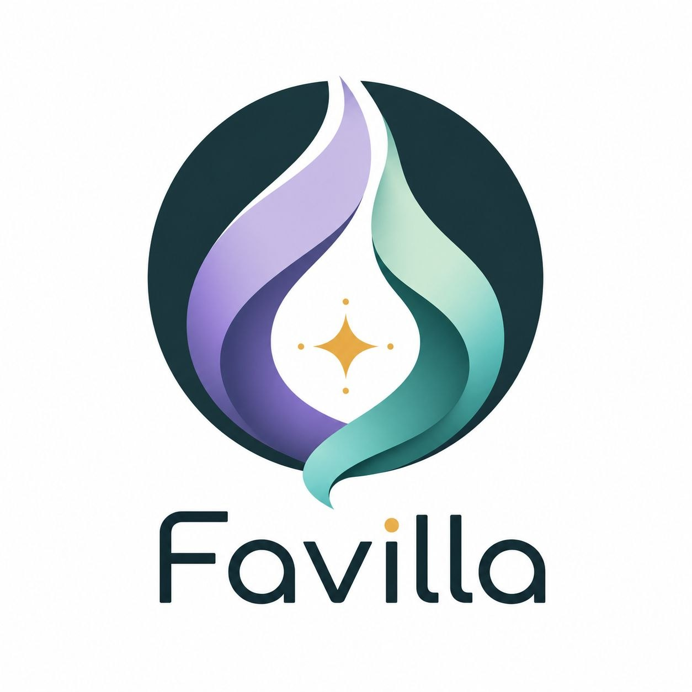
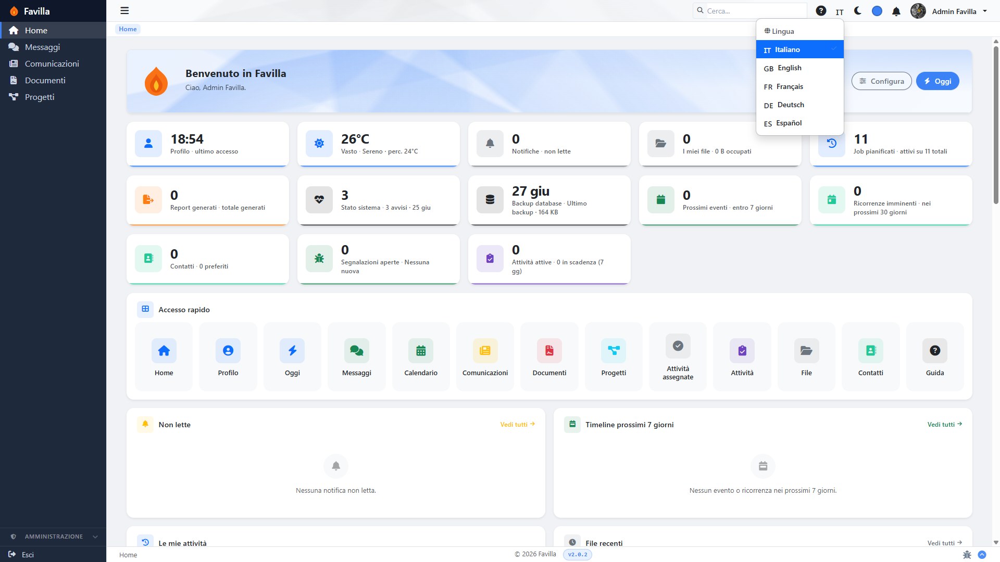
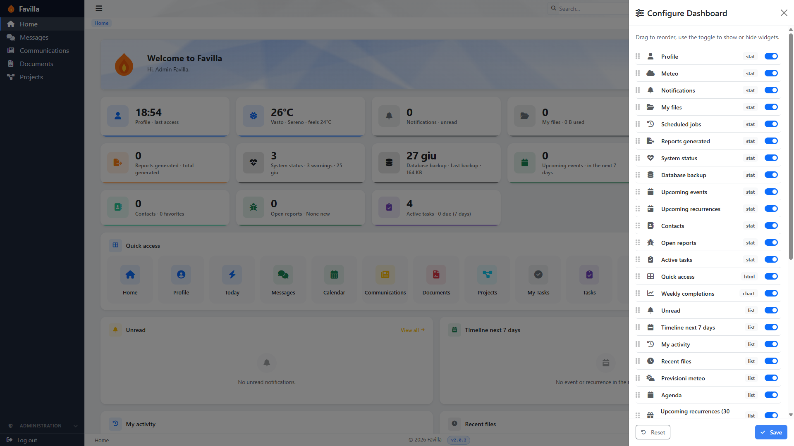
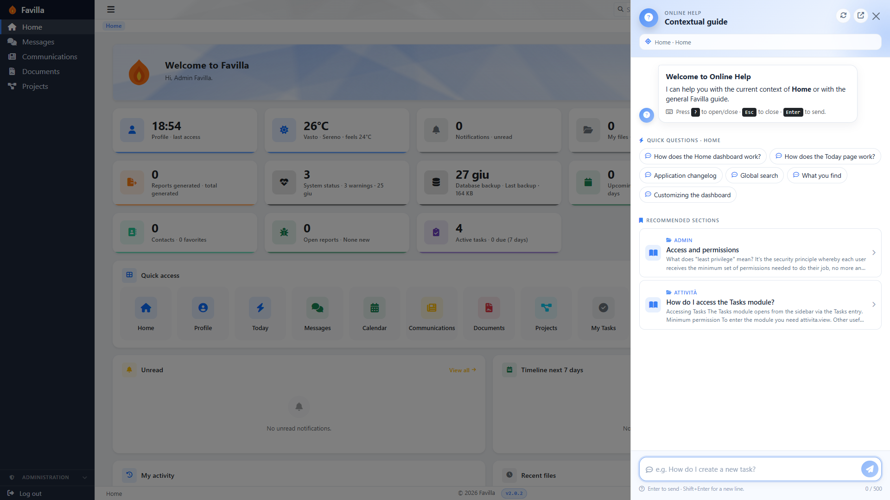
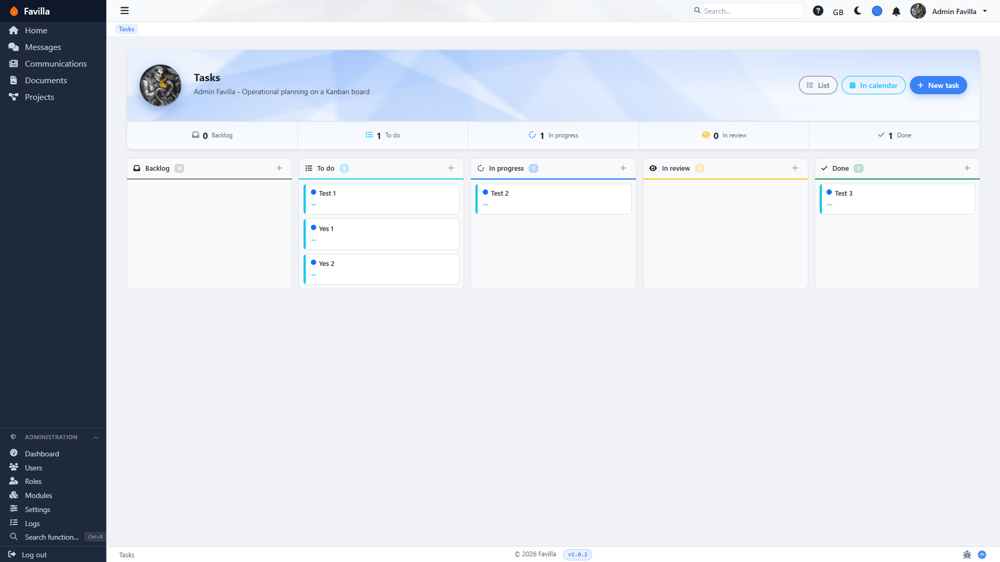
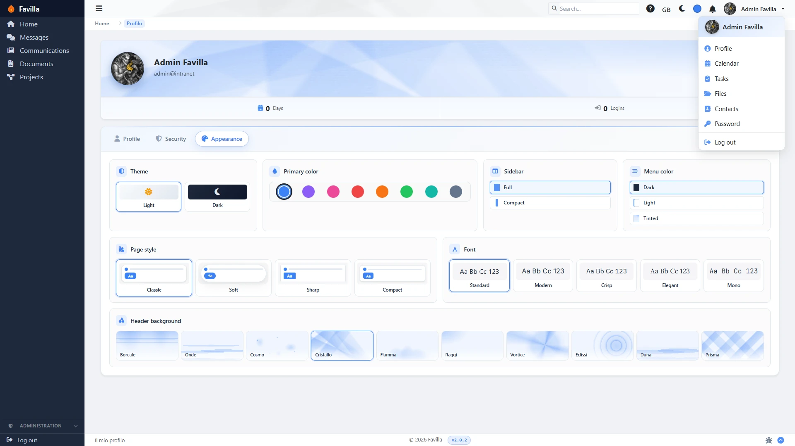

**Il workspace self-hosted che manda avanti la tua azienda — e resta tuo.**

Progetti · Documenti · Chat di team · Attività · Calendario · Contatti · File · Report

🌐 [English](README.md) · **Italiano** · [Français](README.fr.md) · [Deutsch](README.de.md) · [Español](README.es.md)

**Favilla** — la scintilla — è un workspace completo e una intranet aziendale che
ospiti tu stesso: progetti con Gantt, timesheet e budget, documenti con flussi di
approvazione, messaggistica di team, attività kanban, calendari condivisi,
contatti, file, report pronti per la stampa, notifiche multi-canale e una suite
completa di sicurezza e compliance. Venti moduli, cinque lingue, un'unica
installazione, sul tuo server — nessun prezzo per postazione, nessuna telemetria,
niente che "telefona a casa", e la licenza AGPL fa in modo che resti così.

Sulla mappa degli strumenti che già conosci, Favilla sta dove si sovrappongono un
project tracker, un sistema di gestione documentale e un messenger di team — una
intranet operativa nella tradizione di Basecamp, non una suite per ufficio.
Affianca Nextcloud invece di sostituirlo: Favilla non sincronizza file, manda
avanti i tuoi progetti, documenti e processi.

**Cosa non è Favilla:** una suite di file-sync o per ufficio (quello è Nextcloud /
OnlyOffice), un CMS pubblico, un helpdesk rivolto ai clienti o un SaaS
multi-tenant. È un workspace operativo interno per una singola organizzazione,
gestito da quella organizzazione sul proprio server.

## Cosa lo rende diverso

- **Costruisci report come costruisci le slide.** Un designer drag-and-drop
  (GrapesJS) per modelli PDF ed Excel pronti per la stampa, direttamente nel
  browser: componenti dati intelligenti, stili riutilizzabili, sanificazione lato
  server. I report sono cittadini di prima classe, non un ripensamento.
- **Un aiuto che viaggia col prodotto.** Ogni pagina ha un pannello di aiuto
  contestuale alimentato da una knowledge base integrata — oltre 340 domande e
  risposte, ciascuna in tutte e cinque le lingue, con ricerca sensibile ai
  sinonimi e analitiche per gli amministratori su cosa gli utenti cercano e non
  trovano. Meno ticket "come faccio a…?" fin dal primo giorno.
- **Una suite di sicurezza da software a pagamento.** SSO (OIDC) con PKCE,
  collegamento degli account e provisioning JIT opzionale; autenticazione a due
  fattori TOTP; una dashboard di sicurezza con rilevamento incidenti (brute force,
  CSRF); audit log completo; policy di data retention; backup cifrati
  AES-256-GCM con ripristino dall'app; hardening delle sessioni, rate limiting sul
  login, policy delle password.
- **Cinque lingue pronte all'uso.** Italiano (la fonte canonica), inglese,
  francese, tedesco e spagnolo, con selettore per utente — e non solo
  l'interfaccia: anche le notifiche e la knowledge base dell'aiuto sono tradotte.
  (Codice e documentazione sono in inglese.)
- **Un solo codice, tre edizioni.** Personal, Team e Developer sono lo stesso
  prodotto vestito in modo diverso: parti da solo, cresci fino a diventare una
  intranet aziendale senza reinstallare nulla. Vedi le [Edizioni](#edizioni).
- **Pronto per gli assistenti AI.** Il repository include [`CLAUDE.md`](CLAUDE.md),
  inventari dei moduli leggibili dalle macchine (`project_context.json`,
  `context/`) e contratti di architettura scritti (`docs/contracts/`), così gli
  agenti di coding e i nuovi contributori navigano il codice allo stesso modo.
  Gran parte di Favilla è stata costruita in coppia con agenti AI — il workflow è
  di prima classe, non un caso.

E le basi ci sono tutte:

- **Una dashboard che è davvero tua** — 17 provider di widget live (l'agenda di
  oggi, le attività aperte, lo stato dei progetti, la salute dei backup… persino
  il meteo locale); ogni utente sceglie, nasconde e riordina i propri.
- **Notifiche guidate da template** — un unico dispatcher, tre canali (in-app,
  email, Telegram), preferenze per utente, consegna in coda con retry/backoff;
  gli amministratori controllano testo e aspetto dall'interfaccia.
- **Veloce da muoversi** — ricerca globale su tutti i moduli, un menu radiale
  rapido col tasto destro, aggiornamenti parziali HTMX ovunque, temi chiaro e
  scuro.
- **Operatività integrata** — uno scheduler equivalente a cron con interfaccia di
  amministrazione, health check con storico ed export, rotazione dei log e una CLI
  di progetto (`php favilla`) per l'automazione.

## Tecnologia noiosa, fatta per durare

Favilla fa due scelte deliberatamente fuori moda:

1. **PHP 8.2 + HTMX renderizzati lato server.** Niente SPA, niente build step,
   niente `node_modules`. Si installa su qualsiasi cosa, da XAMPP a Docker
   Compose, e gira tranquillamente su un Raspberry Pi.
2. **Un micro-framework custom — niente Laravel, niente Symfony.** Una classica
   applicazione MVC che puoi leggere, verificare ed estendere da cima a fondo:
   controller, service, repository, view, nessuna magia.

Scelte così reggono solo con la disciplina dietro: **oltre 1.800 test automatici**,
**PHPStan livello 6** e **PSR-12** applicati in CI, e uno **schema di oltre 100
tabelle** installato da una procedura guidata.

## Screenshot

| | |
|---|---|
|   *Ogni widget è tuo: trascina per riordinare, tocca per nascondere* |   *Aiuto contestuale con knowledge base ricercabile, su ogni pagina* |
|   *Le attività come lista, calendario o board kanban* |   *Temi, colori, font e stili di layout per ogni utente* |

## Edizioni

Un prodotto che cresce con te. Favilla nasce da un unico codice in tre edizioni,
scelte durante la procedura guidata (o cambiate in seguito da Admin →
Configurazione):

- **Personal** — un workspace per singolo utente. La registrazione è disattivata e
  ogni superficie multi-utente (ruoli, condivisione, area di amministrazione) è
  riposta in un discreto angolo delle Impostazioni. Sembra un'app personale; sotto
  è comunque tutta Favilla.
- **Team** — la intranet aziendale multi-utente: permessi basati sui ruoli,
  registrazione aperta con approvazione dell'amministratore, e Progetti, Teams,
  Documenti e Blog abilitati di default.
- **Developer** — per lavorare su Favilla stessa: il repository completo, incluse
  le documentazioni per contributori e assistenti AI (`CLAUDE.md`,
  `docs/contracts/`, `context/`).

| | **Personal** | **Team** | **Developer** |
|---|---|---|---|
| Pensata per | Workspace personale singolo utente | Intranet aziendale multi-utente | Contribuire a Favilla stessa |
| UI multi-utente / RBAC | Nascosta | Visibile | Visibile |
| Pagina di registrazione | Disattivata (account unico) | Aperta | Aperta |
| Progetti, Teams, Documenti, Blog | Installabili da Admin → Moduli | **Attivi di default** | Installabili da Admin → Moduli |
| Documentazione dev e AI | Non inclusa | Non inclusa | Inclusa |

Un'edizione cambia ciò che l'interfaccia mostra — mai ciò che il codice può fare.
**Nascosto ≠ disattivato:** lo scheduler e tutti i moduli core girano in ogni
edizione, così nulla da cui altre funzioni dipendono (come i promemoria) sparisce
mai. Quando un'installazione Personal smette di essere solo tua, attiva i quattro
moduli di team da **Admin → Moduli** e cambia edizione in **Admin →
Configurazione** — nessuna reinstallazione, nessuna migrazione, nessun
export/import.

## Installazione e documentazione completa

Installazione con Docker o XAMPP, requisiti, aggiornamento, l'elenco completo delle
funzionalità modulo per modulo e la documentazione per sviluppatori sono nel
**[README in inglese](README.md)** e in **[FEATURES.md](FEATURES.md)**.

## Licenza

Favilla è rilasciata sotto **GNU Affero General Public License v3.0 o successiva
(AGPL-3.0-or-later)**. In breve: se esegui una versione modificata di Favilla come
servizio di rete, devi rendere disponibile il codice sorgente modificato ai suoi
utenti. Testo completo in [`LICENSE`](LICENSE).

    

Made in Italy 🇮🇹

